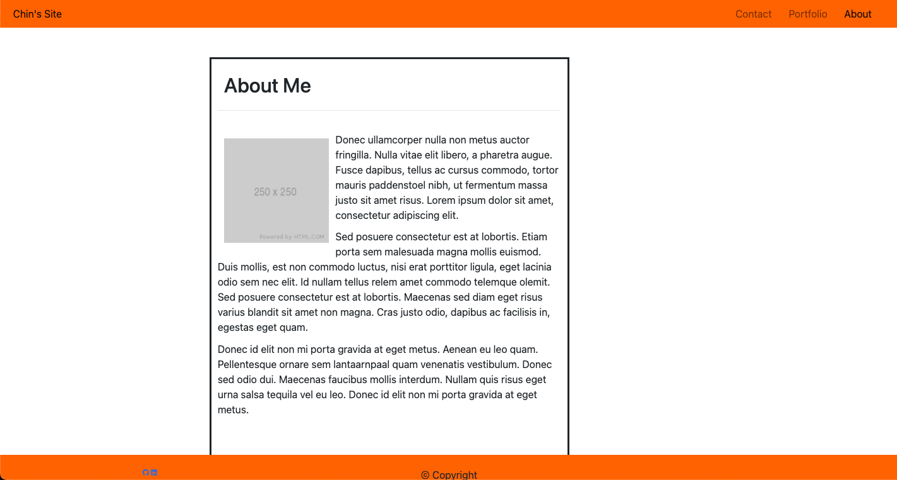
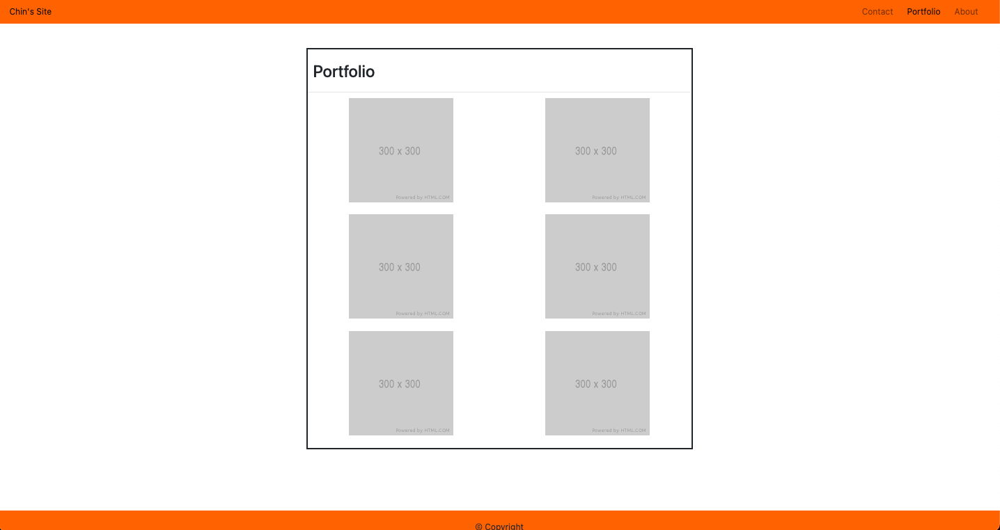

# Responsivve Portfolio 

## Making a Responsive About Me Site

I created a layout of a About Me Portfolio website. The purpose of this is to build a basic template on what a Responsive About Me Template should look like. The template minimizes usage of Media queries and use bootstrap to make sure the site is easily viewable on mobile, tablet, laptop, and computer monitor.

## Pages of the site

[Link to Deployed Site](https://chinedu613.github.io/about_me/)

### Home/About Me Page

### Portfolio Page

### Contact Page

## Contributors

[BootStrap](https://getbootstrap.com/)